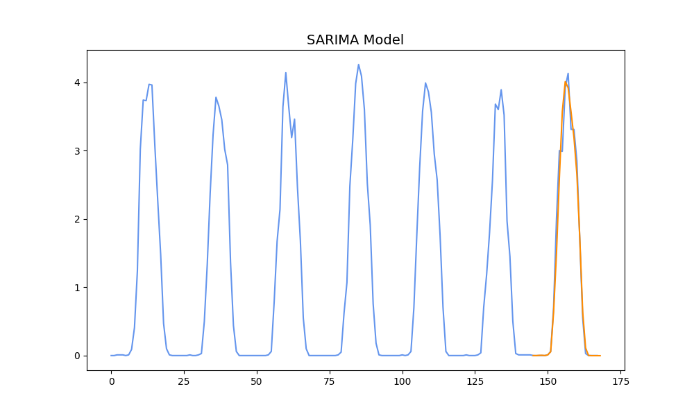
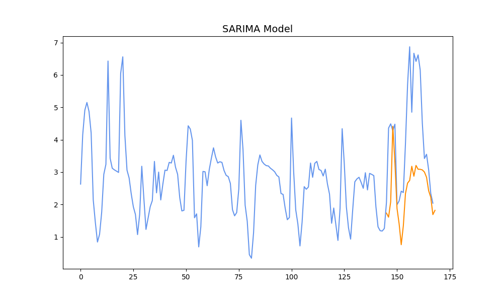
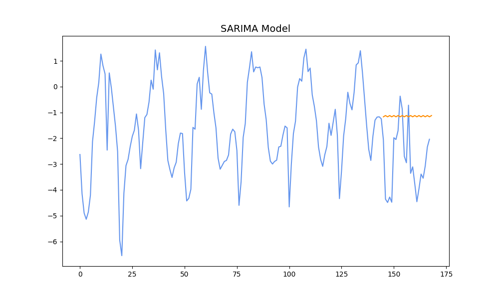
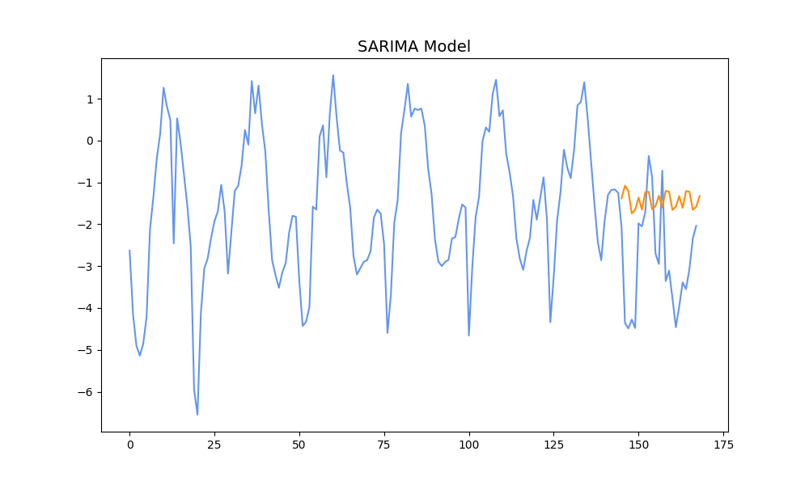
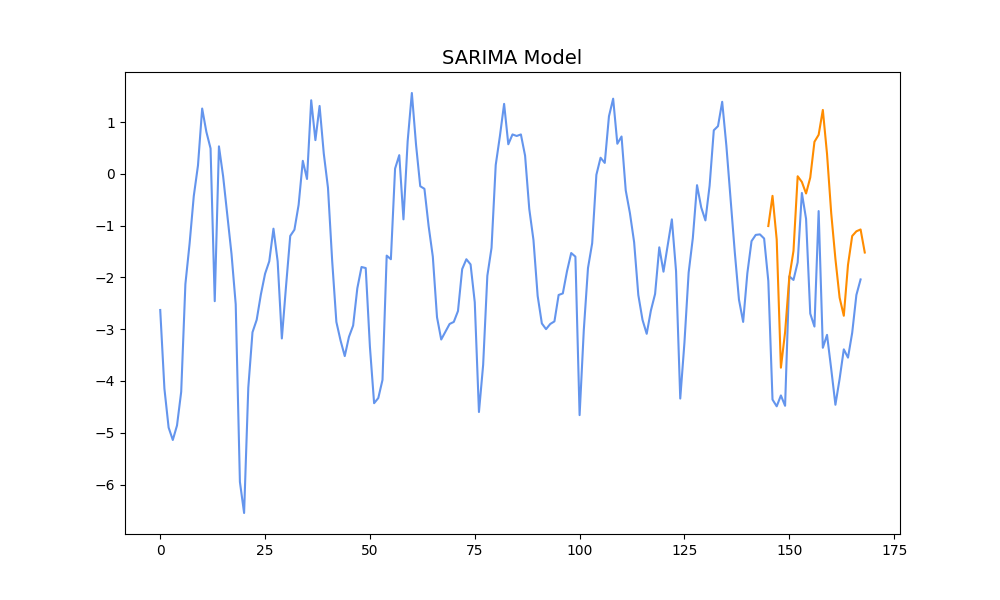
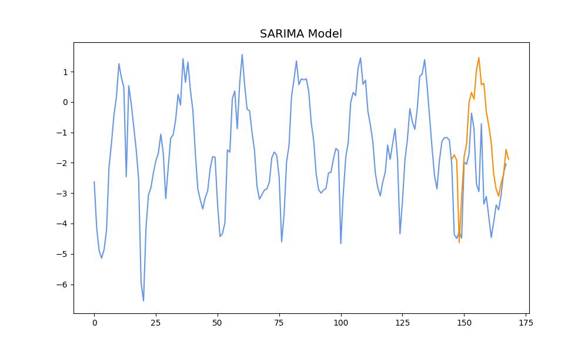

# DSAI-Electric_Bidding

## 資料
在測試的時候，訓練的資料是使用原本 Github repo 裡提供的 sample 資料。

## 過程
因為目標是要先預測當天會不會缺電或是有多出來的電，所以先用 SARIMA 分別預測產電量和用電量。

會得到如下的結果：

- 產電量

- 用電量

可以發現，如果原本的線並不是太規則，後來的預測也只能有個大致的趨勢而已。

## 處理

為了減少進行兩次預測可能產生的誤差，改成用每天的產電量減去用電量後得到的值進行預測。

這麼做的結果如下：

- 用電差

可以發現，雖然趨勢是差不多的，但是整個數值還是有可見的誤差。

我想有一個可能是測試到的這天本來的數據就比較奇怪了。不過因為實際上的資料沒辦法控制，所以只能調一個目前跑起來誤差最小的參數而已。

如果換參數的話，可以發現參數 s 的部分影響滿大的：

- s = 2

- s = 6

- s = 12

- s = 24

- s = 48

以方均根差衡量的話，只要 s 不要小的太誇張，其實最後的結果都是差不多的。

因為一天是 24 小時，而且每次要預測的時長也是 24 小時，所以最後用的 s 是 24。

## 決策

這次打算保守一點，因為最後要輸出的是投標決定，所以目標是不要多買或多賣，導致不必要的虧損就好。

買賣的邏輯是要用預測出來的電力盈餘決定要不要買。由於採用保守的態度，所以投標金額設得很小。另外因為怕預測不準導致賣太多，所以只考慮買的部分。

實際上去看結果，每天其實只會成交那麼幾筆。但是因為原本就要保守一點，所以也算是符合預期。